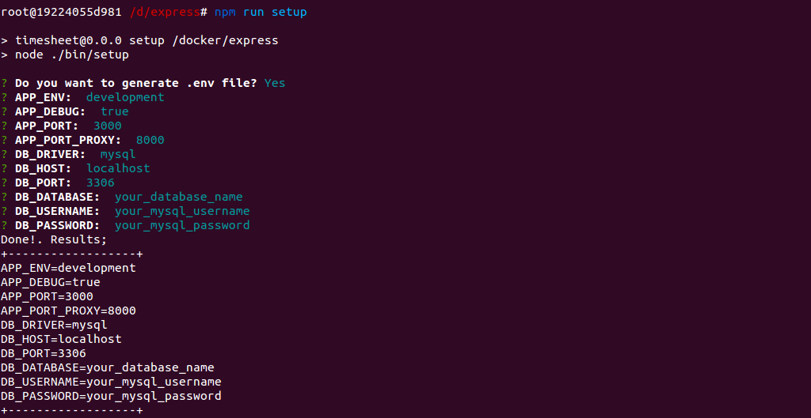
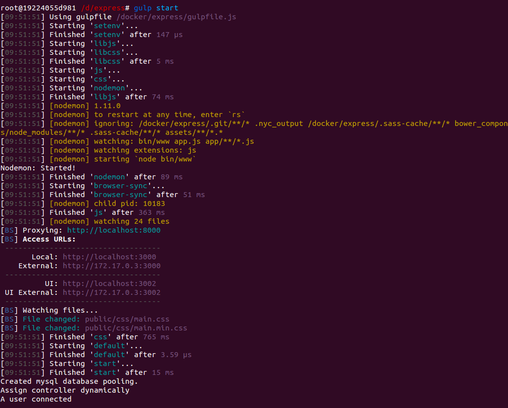

# MVC Framework with Express

## Overview
- This application built with Express, Socket.io
- Features
  - Minification and copying of all JavaScript files, stylesheets, static images with Gulp
  - Monitor for any changes in your node.js application and automatically restart the:
    - Server using Nodemon
    - Browser using Browser-sync
  - MVC structure (Model, View, Controller, Helper, Route(restful, implicit))
  - Setup pooled MySQL connections
  - Avoiding Callback Hell, managing callbacks in MySQL with Async.js.
  - Provide SQL Knex query builder (Like Laravel Query Builder)
  - Make socket.io work fine with the Express generator setup.
  - Load environment variables from a .env file
  - Easy Node Authentication using Passport.js
  - `HTML-like` templating engine with Nunjucks.

## Setup and Run Project

- Clone source and install necessary packages

```bash
$ git clone git@github.com:euclid1990/express.git my-proj
$ cd my-proj
$ yarn install / npm install
$ bower install
```

- Create new database name: `express`

```
$ mysql -u{your_username} -p{your_password}
mysql> CREATE DATABASE express
    DEFAULT CHARACTER SET utf8
    DEFAULT COLLATE utf8_general_ci;
```

- Import `database.sql` into `express` MySQL database

```
$ mysql -u{your_username} -p{your_password} express < database.sql
```

- Run arbitrary package script to change `.env` configuration for correspondence.

```
$ npm run setup
```



- Start server

```
$ gulp start
```



## Access Application

```
http://localhost:3000/
```

## Stop Browser-sync and Nodemon server

Press `Ctr+C` or

```bash
$ sudo apt-get install lsof
$ sudo kill -9 (lsof -i :3000 -t)
$ sudo kill -9 (lsof -i :8000 -t)
```